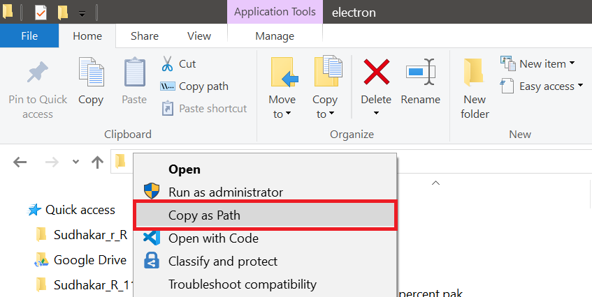

# Copy-as-path-Windows
Adds a  Windows File Explorer context menu for Copying file/directory as path.

### Add

Just run the 'AddCopyAsPath.bat' as Administrator

### Remove

Just run the 'RemoveCopyAsPath.bat' as Administrator

### Screenshot

 
### Thanks to
 
 https://www.askvg.com/registry-tweak-to-add-copy-as-path-option-in-files-and-folders-context-menu-in-windows/
